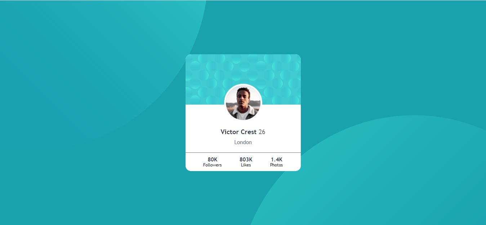

# Frontend Mentor - Profile card component solution

This is a solution to the [Profile card component challenge on Frontend Mentor](https://www.frontendmentor.io/challenges/profile-card-component-cfArpWshJ). Frontend Mentor challenges help you improve your coding skills by building realistic projects. 

## Table of contents

- [Overview](#overview)
  - [The challenge](#the-challenge)
  - [Screenshot](#screenshot)
  - [Links](#links)
- [My process](#my-process)
  - [Built with](#built-with)
  - [What I learned](#what-i-learned)
  - [Continued development](#continued-development)
- [Author](#author)

## Overview

### The challenge

- Build out the project to the designs provided

### Screenshot

### Links

- Solution URL: [Git repository](https://github.com/NobleSimeon/FEM-profile-card-component)
- Live Site URL: [Live site](https://your-live-site-url.com)

## My process

### Built with

- Semantic HTML5 markup
- Flex layouts
- Positioning
- Desktop-first workflow

### What I learned

This is one of the projects I started with and there were alot of things that I don't understand. i understood abit in Positioning

### Continued development

I want to understand positioning more.

## Author

- Website - [Ojelabi Simeon](https://github.com/NobleSimeon)
- Frontend Mentor - [@NobleSimeon](https://www.frontendmentor.io/profile/NobleSimeon)
- Twitter - [@SimeonPelumi](https://www.twitter.com/SimeonPelumi)

